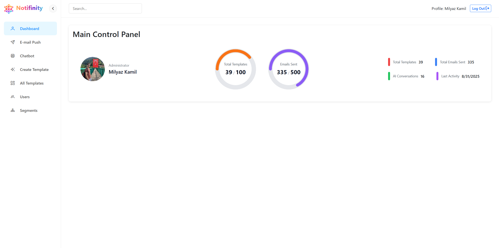

# Notifinity: AI-Powered Email Marketing Service

## Notifinity is an AI-powered email marketing dashboard built with Vue 2. It features a drag-and-drop email builder that uses Google's Gemini AI and the Pixabay API to generate complete, image-rich templates from a single text prompt. The platform also includes a full user management system with AI-driven segmentation and a chatbot assistant, all connected to a real-time Firebase backend.

### [Preview website](https://lighthearted-daffodil-de17eb.netlify.app/) 
